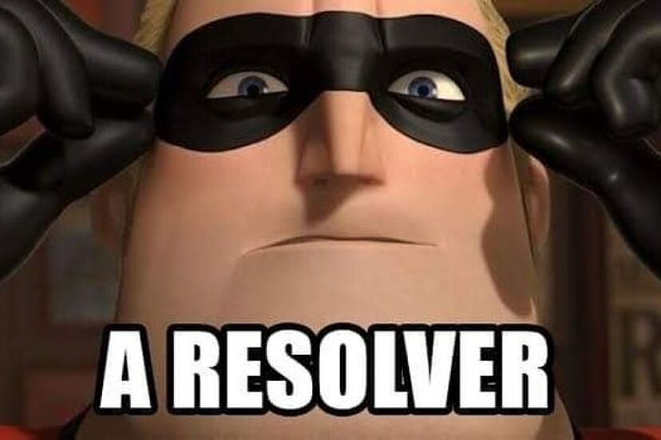

Presentación de
# Zarate Braian

Hola mi nombre es Braian, tengo 24 años y actualmente me encuentro cursando el tercer cuatrimestre de la carrera de Licenciatura en Informatica.
Mis conocimientos sobre la programacion no son más de lo que he visto en la univeridad durante el tiempo de mi cursada, pero es algo que realmente me gusta y voy a poner todo de mi para poder aprender todo lo que pueda durante esta cursada.

## Más cosas sobre mi:
* Actualmente estoy haciendo mi casa propia.
* Tengo una nena pequeña.
* Trabajo durante la semana como maquinista en una fabrica de pañales. 
* Me gusta el anime y los mangas.
* Estoy tratando de hacer todos los cursos de programación que pueda.